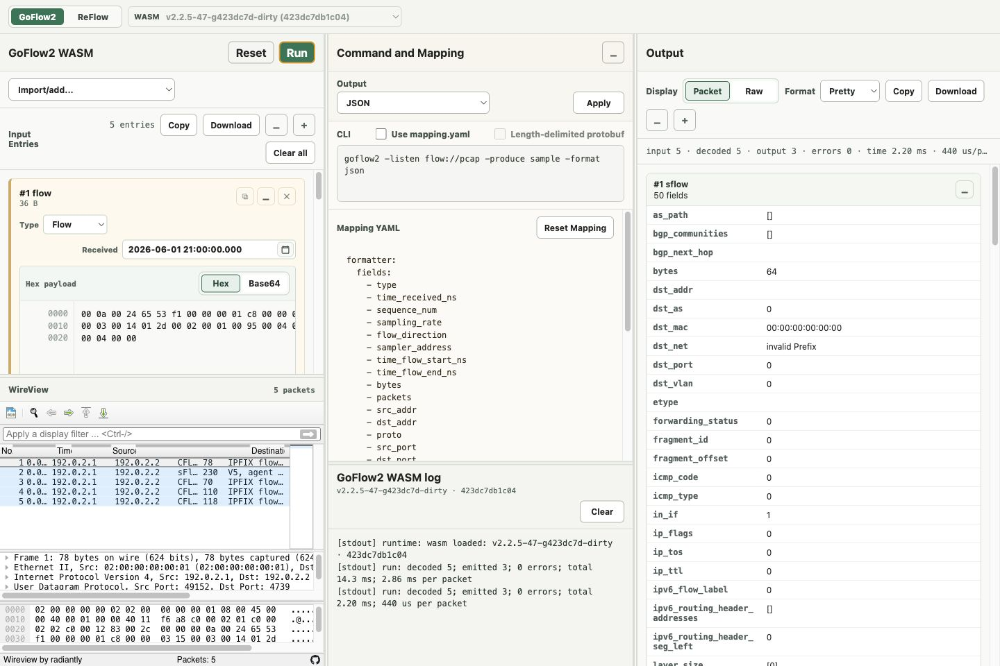
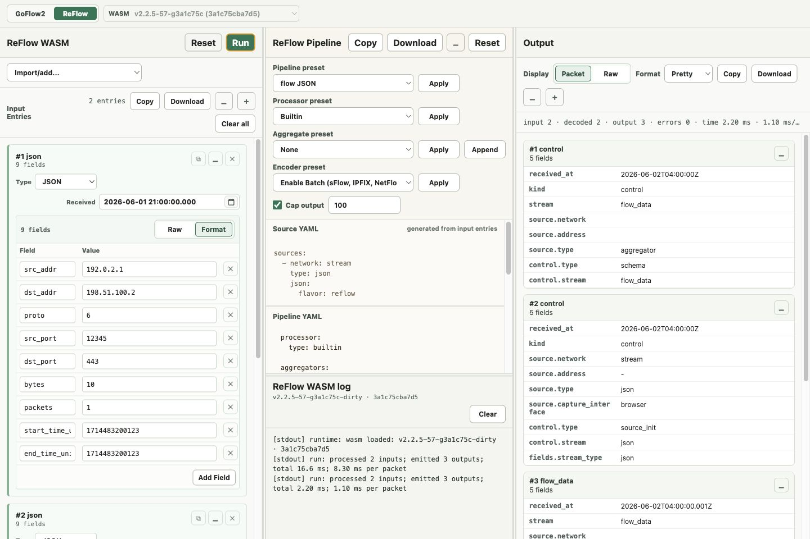

# Flows WASM

Flows WASM is a browser workspace for decoding, transforming, and re-encoding flow data with Go-compiled WebAssembly modules. It packages two adapters behind the same three-pane UI:

- [GoFlow2](https://github.com/netsampler/goflow2) for decoding NetFlow, IPFIX, and sFlow datagrams.
- ReFlow, from the GoFlow2 module, for browser-side flow pipeline experiments.

Open the hosted app on [GitHub Pages](https://netsampler.github.io/wasm/).

The app runs the WASM modules in a worker, renders packets with [WireView](https://github.com/radiantly/Wireview), and keeps the workflow local to the browser.

## Screenshots

### GoFlow2 decode workflow



### ReFlow pipeline workflow



## Quick Start

Install dependencies:

```sh
npm install
```

Start the local app:

```sh
npm run dev
```

Build a production bundle:

```sh
npm run build
```

The `dev` and `build` scripts rebuild the Go/WASM artifacts before starting Vite. The Go modules live in `apps/goflow2/wasm` and `apps/reflow/wasm`; use toolchains compatible with the `go.mod` files.

Useful scripts:

```sh
npm run build:wasm
npm run build:wasm:goflow2
npm run build:wasm:reflow
npm run test:wasm:goflow2
npm run test:wasm:reflow
```

## Workflow

The UI has three panes:

1. **Input**: add samples, import captures, edit payloads, timestamps, and input types.
2. **Config**: choose the GoFlow2 command/mapping or edit the ReFlow pipeline YAML.
3. **Output**: inspect parsed records or raw encoded packets, then copy or download the result.

Use the top-left tabs to switch between `GoFlow2` and `ReFlow`. The WASM selector shows the runtime loaded from `public/*-wasm-manifest.json`.

## Import

Inputs are edited as entries. Each entry has a type, received timestamp, payload editor, and optional source metadata.

Supported entry types by adapter:

| Adapter | Types |
| --- | --- |
| GoFlow2 | `bytes`, `flow` |
| ReFlow | `bytes`, `flow`, `json`, `pcap`, `pcapng` |

`bytes` means slightly different things in each adapter. In GoFlow2, a bytes entry should be a complete packet carrying an IPFIX, sFlow, or NetFlow datagram, including the Ethernet + IP headers. In ReFlow, a bytes entry is just packet bytes that the browser runtime passes to the ReFlow source parser.

Import options:

- **Add empty** creates a new bytes entry.
- **Presets** append built-in IPFIX, NetFlow v9, NetFlow v5, sFlow, and ReFlow JSON examples.
- **Import JSON input list** restores entries from an exported JSON file.
- **Import PCAP as bytes** imports capture frames as raw packet bytes.
- **Import PCAP as flow** imports flow datagrams and wraps them as synthetic UDP packets when needed for visualization.
- **Import whole PCAP/PCAPNG** is available in ReFlow for passing a capture as one input entry.

Payload editors support hex and base64 for binary inputs. JSON entries support raw JSON or a field table. The input pane can copy or download the current input list.

JSON input lists can be object-based:

```json
[
  {
    "type": "flow",
    "payload": "AAoAJGVT8QAAAAHIAAAAAxUAAwAUAS0AAgABAJUABAAiAAQAAA==",
    "receivedAt": "2026-06-02T04:00:00.000Z"
  }
]
```

ReFlow also exports and imports tuple-style inputs:

```json
[
  ["json", { "src_addr": "192.0.2.1", "dst_addr": "198.51.100.2", "bytes": 10 }],
  ["flow", "AAoAJGVT8QAAAAHIAAAAAxUAAwAUAS0AAgABAJUABAAiAAQAAA==", "2026-06-02T04:00:00.000Z"]
]
```

## Config

### GoFlow2

The GoFlow2 config pane shows the generated CLI command:

```sh
goflow2 -listen flow://pcap -produce sample -format json
```

Output presets change the command:

| Preset | Command behavior |
| --- | --- |
| JSON | `-produce sample -format json` |
| Proto | `-produce sample -format bin` |
| Raw | `-produce raw -format json` |

Enable **Use mapping.yaml** to pass the Mapping YAML editor to GoFlow2 as `-mapping mapping.yaml`. The default mapping selects common formatter fields, uses `sampler_address` as the key, renders `time_received_ns`, and maps IPFIX/NetFlow v9 field `61` to `flow_direction`.

When the Proto preset is active, **Length-delimited protobuf** emits varint-delimited protobuf messages for tools that expect framed records.

### ReFlow

The ReFlow config pane combines generated browser sections with your editable pipeline:

```yaml
sources:
  - network: stream
    type: json
    json:
      flavor: reflow

processor:
  type: builtin

aggregators:
  - stream: flow_data
    window:
      idle_flush_after_ms: 60000
    fields:
      - key:src_addr
      - key:dst_addr
      - sum:bytes

encoder:
  type: json
  json:
    flavor: canonical

sink:
  type: stdout
```

`sources` are generated from the current input entry types. `sink` is fixed to browser stdout. The editable middle section controls the ReFlow processor, aggregators, encoder, batching, and limits.

Presets can replace or append YAML sections:

- Pipeline presets: flow JSON, interface IPFIX, counters sFlow, batch IPFIX.
- Processor presets: builtin, NAT replacement, decode encap.
- Aggregate presets: none, flow, NAT, encap, interfaces, IPFIX options, passthrough, periodic flow.
- Encoder presets: JSON, protobuf, sFlow, IPFIX, NetFlow v5/v9, PCAP, PCAPNG, and batch settings.

Use **Copy** or **Download** in the config header to export the full browser config, including generated `sources` and `sink`.

## Output

After **Run**, the output pane shows status, statistics, and records.

Display modes:

| Mode | Use |
| --- | --- |
| Packet | Structured record cards and packet payload cards. |
| Raw | Plain text, hex, or base64 output for copying into other tools. |

Encoding options depend on the result:

- **Pretty** expands JSON or decodes protobuf payloads in a `protoc --decode_raw` style.
- **Text** shows JSON lines or text output.
- **Hex** shows binary output as contiguous hex or a hex dump.
- **Base64** shows binary output as base64.

Copy and download behavior:

- **Copy** prefers native binary output when the browser clipboard supports it, otherwise it copies the displayed text.
- **Download** writes native output when available, such as `.pcap`, `.pcapng`, `.ipfix`, `.sflow`, `.nfv5`, `.nfv9`, `.pb`, or `.bin`.
- Individual packet payload cards can be downloaded separately.

WireView is embedded in two places:

- GoFlow2 shows an input WireView panel for the synthetic or imported capture.
- ReFlow shows an output WireView panel when the encoder produces a PCAP-like binary capture.

## Runtime Assets

Build scripts write runtime assets into `public/`:

- `goflow2.wasm`
- `reflow.wasm`
- `wasm_exec.js`
- `goflow2-wasm-manifest.json`
- `reflow-wasm-manifest.json`
- WireView assets: `wiregasm.js`, `wiregasm.wasm`, `wiregasm.bmp`, `wireshark.svg`

The manifests support multiple runtime versions. The app loads the default version and displays the selected version in the toolbar.

## Project Layout

```text
apps/goflow2/wasm/      GoFlow2 WASM adapter
apps/reflow/wasm/       ReFlow WASM adapter
public/                 WASM, manifests, worker, and WireView runtime assets
scripts/                WASM build and asset copy scripts
src/main.js             Main browser UI and adapter orchestration
src/styles.css          App layout and component styling
src/wireview-frame.js   Embedded WireView frame
```

## Links

- [GoFlow2](https://github.com/netsampler/goflow2)
- [WireView](https://github.com/radiantly/Wireview)
- [Vite](https://vite.dev/)
- [Go WebAssembly](https://go.dev/wiki/WebAssembly)
